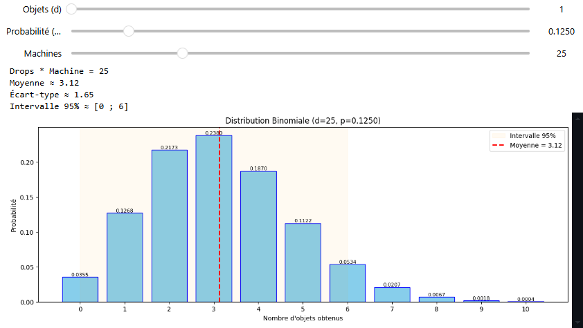

# Binomial Distribution Calculator

This Jupyter Notebook calculates the binomial distribution for a given drop rate and number of machines.

It provides a graphical representation of the probabilities and highlights significant values.

## Installation


The graph uses the `ipywidgets` library for interactive widgets and `matplotlib` for plotting. Make sure to install these packages if you have not already done so:

```bash
pip install ipywidgets matplotlib
```


The binomial distribution is calculated using the `scipy.stats.binom` module.

```bash
pip install scipy
```

## Usage

This is a Jupyter Notebook, so you can run it in any Jupyter environment.


Run the code and use the generated graph to analyze the binomial distribution based on the specified drop rate and number of machines.


You can customize the maximum values using the variables.


> [!WARNING]
> Some small probabilities are removed from the graph when the probability is less than 0.00009 to avoid cluttering the graph with insignificant values.

## Example



---

## Personal usage


This notebook was created to facilitate calculations for item drops in a Minecraft mod (ExDeorum). It allows you to visualize the probability of obtaining a certain number of drops based on the drop rate and the number of machines used.

It uses the mathematical formula for the [binomial distribution](https://en.wikipedia.org/wiki/Binomial_distribution):

```math
P(X = k) = C(n, k) * p^k * (1 - p)^(n - k)
```
